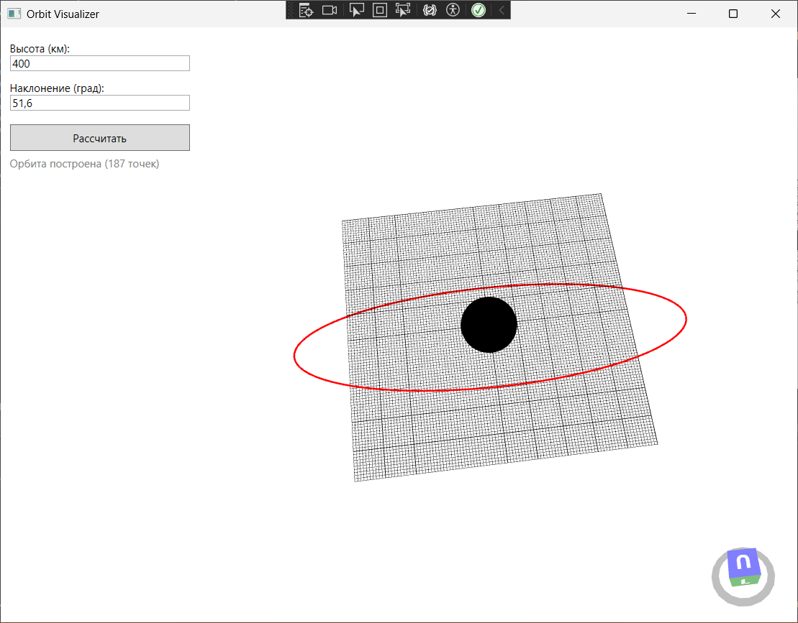

# OrbitVisualizer

Интерактивное desktop-приложение для расчёта и 3D-визуализации орбит спутников.
Пользователь задаёт параметры орбиты через графический интерфейс (WPF),
сервер на Python (FastAPI) выполняет численное интегрирование методом Рунге-Кутты 4-го порядка,
а результат отображается в реальном времени в трёхмерной сцене с помощью HelixToolkit.

---

## 🏗️ Архитектура

Проект построен по клиент-серверной модели:

- **Бэкенд:** Python + FastAPI. Содержит эндпоинт `POST /orbit`, принимает параметры орбиты (высота, наклонение, эксцентриситет и др.) и возвращает массив точек `[[x, y, z], ...]` в формате JSON. Использует кеплеровский симулятор из проекта 1.
- **Фронтенд:** C# (.NET 8) + WPF + HelixToolkit. Построен по паттерну MVVM. ViewModel отправляет HTTP-запрос к серверу, десериализует ответ и обновляет коллекцию 3D-точек, привязанную к элементу `LinesVisual3D`. Интерфейс остаётся отзывчивым благодаря асинхронным вызовам.

---

## 🛠 Технологии

| Компонент | Технология |
|-----------|------------|
| Бэкенд | Python 3.11, FastAPI, NumPy |
| Фронтенд | C#, .NET 8, WPF |
| 3D-визуализация | HelixToolkit (HelixToolkit.Wpf) |
| HTTP-клиент | HttpClient (System.Net.Http) |
| Сериализация | System.Text.Json |

---

## ✨ Функциональность

- Ввод параметров орбиты: высота, наклонение, эксцентриситет, RAAN, аргумент
  перигея, шаг интегрирования, число точек.
- Отправка запроса на сервер и получение траектории.
- 3D-сцена:
  - Сфера Земли (с текстурой, опционально)
  - Линия орбиты, построенная по точкам
  - Оси координат
  - Вращение, масштабирование мышью
- Мгновенное обновление орбиты при изменении параметров.
- Обработка ошибок: сервер недоступен, некорректные параметры.

---

## 🔍 Как работает бэкенд

1. FastAPI принимает POST-запрос на `/orbit` с параметрами орбиты.
2. Pydantic-модель `OrbitRequest` проверяет корректность данных (диапазоны высот, углов, шага).
3. Вызывается функция `calculate_orbit` из `orbit_calc.py`.
4. Орбитальные элементы преобразуются в декартовы координаты:
   - расстояние $r = a(1-e^2)/(1+e\cos\nu)$;
   - координаты в орбитальной плоскости;
   - поворот в инерциальную систему через матрицы $R_z(\Omega) R_x(i) R_z(\omega)$.
5. Начальное состояние интегрируется методом Рунге–Кутты 4-го порядка на одном витке.
6. Траектория возвращается в формате JSON.

---

## 🧮 Математическая модель (кратко)

Уравнение движения:

$$ \ddot{\mathbf{r}} = -\frac{\mu}{r^3}\mathbf{r} $$

где $\mu = 3.986 \cdot 10^{14}\ \text{м}^3/\text{с}^2$ — гравитационный параметр Земли.

Метод Рунге–Кутты 4-го порядка реализован вручную в `orbit_calc.py`.

Схема одного шага:

$$
\begin{aligned}
k_1 &= f(t_n, y_n) \\
k_2 &= f(t_n + \frac{\Delta t}{2}, y_n + \frac{\Delta t}{2} k_1) \\
k_3 &= f(t_n + \frac{\Delta t}{2}, y_n + \frac{\Delta t}{2} k_2) \\
k_4 &= f(t_n + \Delta t, y_n + \Delta t k_3) \\
y_{n+1} &= y_n + \frac{\Delta t}{6}(k_1 + 2k_2 + 2k_3 + k_4)
\end{aligned}
$$

## ⚙️ Обработка ошибок

Сервер недоступен: клиент показывает сообщение «Ошибка: сервер недоступен» и очищает текущую орбиту.

Некорректные параметры: FastAPI возвращает 422 Validation Error с указанием проблемного поля.

Ошибка расчёта: на экран выводится сообщение без завершения приложения.

